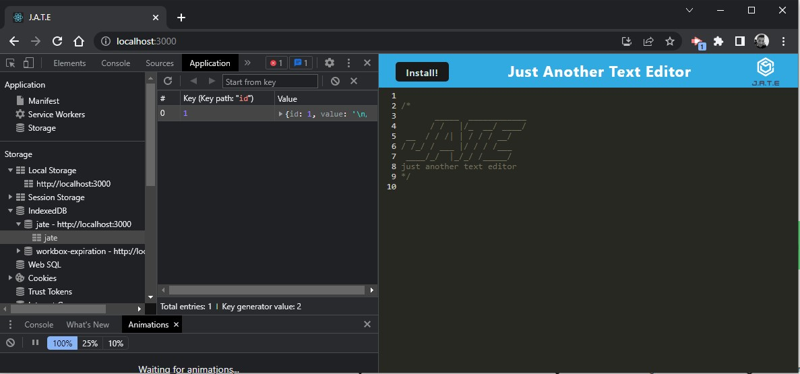
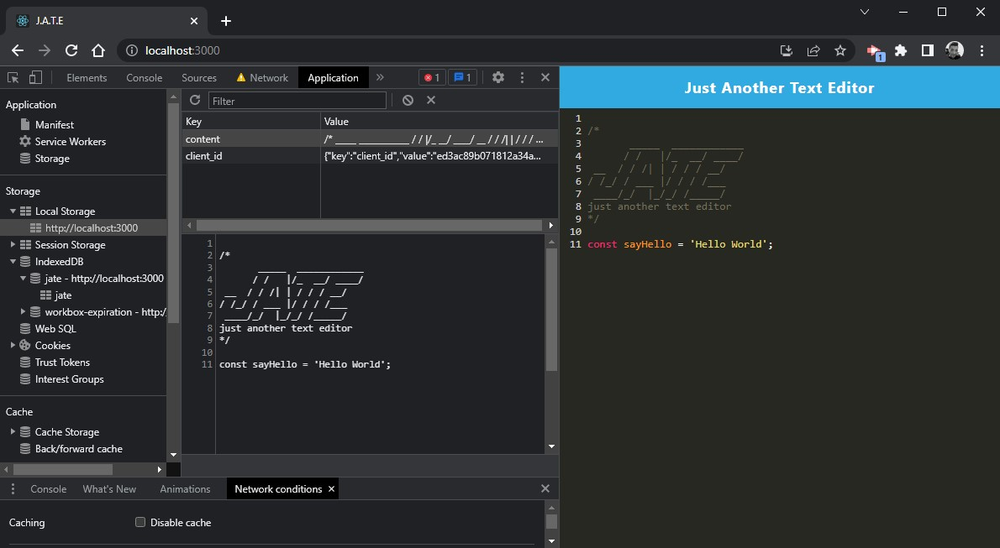
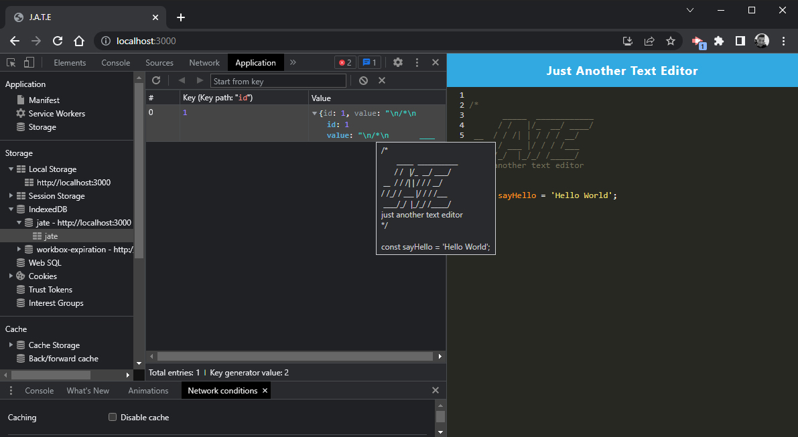
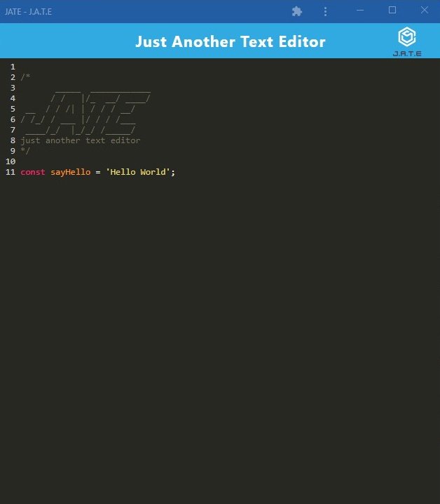

# JATE - Just Another Text Editor

This is a single page text editor application that meets the PWA criteria. It  features a number of data persistence techniques, using IndexDB and local storage, that serve as redundancy in case one of the options is not supported by the browser. The application will also function offline. 

## Installation
> Clone the app
```
> git clone (clone_addess) 
```
> Initialise and installing necessary npm packages and dependencies
```
> npm install
```
> Run the application locally
```
> npm run start
```
A distribution will be generated with bundled Javascript files, an index.html, service worker and a manifest json file. A server is then launched on port 3000. Run the application on your browser with the link: ```http://localhost:/3000```

## Usage
When the appplication is first loaded through the browser, we are prompted with the JATE text editor. 



Enter some text and when the local storage is refreshed, the local storage data is updated


When the IndexDB is refreshed, the JATE database is updated. If the network is offline, the JATE database will not save on refresh, but will save on the next time the application is launched, provided the data is still on local storage. 


Click Install button to download and install the application with an icon to the desktop.  


## Link to deployment application
https://jate-wk19.herokuapp.com/
